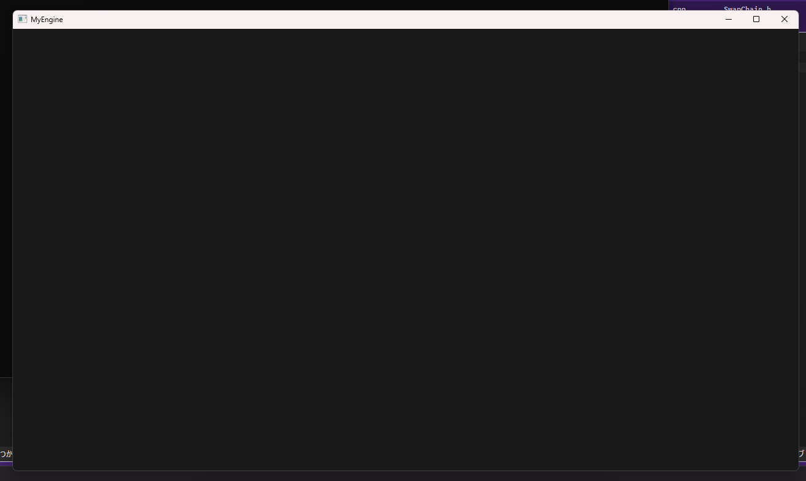

# MyEngine 現在の成果

## コード計算
| Language | files | blank | comment | code
|---|---|---|---|---|
| C++ | 14 | 259 | 39 | 1018 | 
| C/C++ | 16 | 147 | 25 | 447 |
| HLSL | 3 | 4 | 0 | 23 |
| SUM | 33 | 410 | 64 | 1488 |

## 画面クリア処理 Date: 2026/05/10 | Branch: feature/dx12_screen_clear

## 四角形ポリゴン描画 Date: 2026/05/10 | Branch: feature/dx12_draw_polygon
